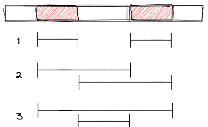

# C - Flippy Sequence

## Basic Information

<table>
<tr>
<td><b>Contest</b></td><td>The 2018 ICPC Asia Qingdao Regional Contest</td>
</tr>
<tr>
<td><b>Team AC Ratio</b></td><td>351/373 (94.1%)</td>
</tr>
</table>

## Tutorial

First, find out in which intervals $s$ and $t$ are different.

We can only flip at most two intervals with two operations. If there are more than two intervals which are different, there is no solution and the answer is $0$.

Next, let's discuss the cases where there are $0$, $1$ or $2$ different intervals.

### No Different Interval

If $s$ and $t$ are equal, both operations must flip the same interval to keep $s$ unchanged. So the answer is the number of non-empty intervals, that is, $(\frac{n(n - 1)}{2} + n)$.

### One Different Interval

If there is exactly one interval, we have two types of ways to perform the operations. Let the length of the interval be $l$.


Type One: Choose two non-intersecting intervals such that their union is our target interval. There are $2(l - 1)$ ways of this type.

Type Two: Choose two intersecting intervals such that their difference is our target interval. There are $2(n - l)$ ways of this type.

So the answer is $2(l - 1) + 2(n - l) = 2(n - 1)$。

### Two Different Intervals

If there are two intervals, we have three types of ways to perform the operations.



By changing the order of the two operations we get two ways from each type. So the answer is $2 \times 3 = 6$.

The time complexity is $\mathcal{O}(n)$.

## Solution

```c++ linenums="1"
#include <bits/stdc++.h>
#define MAXN ((int) 1e6)
using namespace std;
typedef pair<int, int> pii;

int n;
char A[MAXN + 10], B[MAXN + 10];

void solve() {
    scanf("%d%s%s", &n, A + 1, B + 1);

    // calculate which intervals are different
    vector<pii> vec;
    int bgn = -1;
    for (int i = 1; i <= n; i++) if (A[i] != B[i]) {
        if (A[i - 1] == B[i - 1]) bgn = i;
        if (A[i + 1] == B[i + 1]) vec.push_back(pii(bgn, i));
    }

    // discuss the cases
    if (vec.size() == 0) printf("%lld\n", 1LL * n * (n - 1) / 2 + n);
    else if (vec.size() == 1) printf("%d\n", 2 * (n - 1));
    else if (vec.size() == 2) printf("6\n");
    else printf("0\n");
}

int main() {
    int tcase; scanf("%d", &tcase);
    while (tcase--) solve();
    return 0;
}
```
