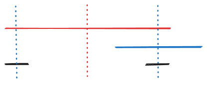

# G - Paper-cutting

## 基本信息

<table>
<tr>
<td><b>题目出处</b></td><td>2019 陕西省大学生程序设计竞赛</td>
</tr>
<tr>
<td><b>队伍通过率</b></td><td>1/111 (0.9%)</td>
</tr>
</table>

## 题解

容易注意到，左右对折和上下对折互不影响，因此接下来我们只考虑左右对折。

为了方便讲解，我们先考虑 $n = 1$ 的情况，并假设只允许从左往右折。设唯一一行的元素是 $s_1s_2\cdots s_m$，令 $s[l:r]$ 表示子串 $s_ls_{l + 1}\cdots s_r$。可以发现，如果我们想要把前 $j$ 列折到右边，需要满足 $s[1:2j]$ 是回文串。对折之后，就相当于把字符串开头的前 $j$ 个字符删掉。

此时读者可能会产生一个朴素的贪心策略：从第一个字符开始从左到右枚举回文串的中心，能折就折。设 $s[1:2p]$ 是以第一个字符为开头的最短的回文串，$s[1:2q]$ 是以第一个字符为开头的另一个回文串，接下来我们将证明，折 $s[1:2q]$ 能到达的中间状态，折 $s[1:2p]$ 一定能到达。

讨论 $p$ 和 $q$ 的关系：

* 若 $p \le 2q$，则 $s[1:2p]$ 和 $s[2q-2p+1:2q]$ 是两个相同的回文串（下图红色部分），而 $s[2p+1:2q-2p]$ 也是回文串（下图蓝色部分），因此 $s[p+1:2q-p]$ 也是回文串（下图绿色部分）。因此如果我们先折 $s[1:2p]$（即删掉 $s[1:p]$），接下来可以再折 $s[p+1:2q-p]$（即删掉 $s[p+1:q]$）。这和直接折 $s[1:2q]$（即删掉 $s[1:q]$）是一样的。
  
    

* 若 $p > 2q$，则下图蓝色部分都是相同的回文串。说明 $s[1:2p]$ 不是以第一个字符为开头的最短回文串（蓝色回文串才是），与假设矛盾。

    

因此，其它所有折纸策略能到达的中间状态，一定能被“能折就折”的贪心策略到达。

那什么时候停止折纸呢？是不是直到不能再折才停止是最优的？我们的目的是最小化 $0$ 的连通块的数量，因此我们观察一下对折前后连通块数量的变化。

* 考虑不跨过对称中心的连通块 $s[l:r]$（$1 \le l \le r < p$），则它有一个对称的连通块 $s[2p - r:2p - l]$。对折之后，两个连通块只剩下一个，连通块的数量减少。
* 考虑跨过对称中心的连通块 $s[l:2p-l]$（$1 \le l \le p$）。对折之后它还是一个连通块，连通块数量不变。

因此折得越多，连通块数量越少。而贪心策略因为经过了其它所有折纸策略的中间状态，因此它的最终状态（折到不能再折）就是折得最多的状态，也就是最优状态。

接下来开始考虑从右往左折。此时读者可能会担心：两种折法会不会冲突？会不会从左往右折了一下，本来能从右往左折的，现在不行了？接下来将证明只要两种折法都使用“能折就折”的贪心策略，就不会冲突，因此可以分别考虑。

如下图所示，如果两种折法（下图的红色回文串和蓝色回文串）冲突了，说明其中一个回文串的对称轴位于另一个回文串内部。此时下图黑色回文串是以第一个字符为起点的更短的回文串，说明选择红色回文串不符合“能折就折”的贪心策略，与假设矛盾。



因此我们只要分别考虑四个方向，每个方向遵循“能折就折”的贪心策略，就能最小化 $0$ 的连通块数量。回文串可以用 manacher 算法预处理，复杂度 $\mathcal{O}(nm)$。

## 参考代码

```c++ linenums="1"
#include <bits/stdc++.h>
#define MAXPROD ((int) 1e6)
using namespace std;
typedef pair<int, int> pii;

int n, m, ans;
string MAP[MAXPROD];
char s[MAXPROD + 10];

string tmp[MAXPROD];
int f[MAXPROD];
vector<bool> vis[MAXPROD];

// 从下往上折，能折就折，返回最后的下边界
int gao() {
    // manacher
    for (int i = 0, l = 0, r = -1; i < n; i++) {
        int k = (i > r) ? 0 : min(f[l + r - i + 1], r - i + 1);
        while (0 <= i - k - 1 && i + k < n && MAP[i - k - 1] == MAP[i + k]) k++;
        f[i] = k--;
        if (i + k > r) l = i - k - 1, r = i + k;
    }

    // 枚举回文串中心 now
    int ret = n - 1, now = n - 1;
    while (now - (ret - now + 1) >= 0) {
        // 发现包含最后一行的最短回文串
        if (now + f[now] > ret) ret = now - 1;
        now--;
    }
    return ret + 1;
}

// bfs 求连通块
short dir[4][2] = {0, 1, 1, 0, -1, 0, 0, -1};
void bfs(int SI, int SJ) {
    queue<pii> q;
    q.push(pii(SI, SJ)); vis[SI][SJ] = true;
    while (!q.empty()) {
        auto [i, j] = q.front(); q.pop();
        for (int k = 0; k < 4; k++) {
            int ii = i + dir[k][0], jj = j + dir[k][1];
            if (ii < 0 || jj < 0 || ii >= n || jj >= m || MAP[ii][jj] == '1' || vis[ii][jj]) continue;
            q.push(pii(ii, jj)); vis[ii][jj] = true;
        }
    }
}

void solve() {
    scanf("%d%d", &n, &m);
    for (int i = 0; i < n; i++) scanf("%s", s), MAP[i] = string(s);

    // 每次都从下往上折，折完以后旋转 90 度，重复 4 次就能折 4 个方向
    for (int k = 1; k <= 4; k++) {
        n = gao();
        for (int j = 0; j < m; j++) tmp[j].resize(n);
        for (int i = 0; i < n; i++) for (int j = 0; j < m; j++) tmp[m - 1 - j][i] = MAP[i][j];
        swap(n, m);
        for (int i = 0; i < n; i++) MAP[i] = tmp[i];
    }

    // bfs 统计 0 的连通块数量
    ans = 0;
    for (int i = 0; i < n; i++) vis[i] = vector<bool>(m);
    for (int i = 0; i < n; i++) for (int j = 0; j < m; j++) if (MAP[i][j] == '0' && !vis[i][j]) bfs(i, j), ans++;
    printf("%d\n", ans);
}

int main() {
    int tcase; scanf("%d", &tcase);
    while (tcase--) solve();
    return 0;
}
```
