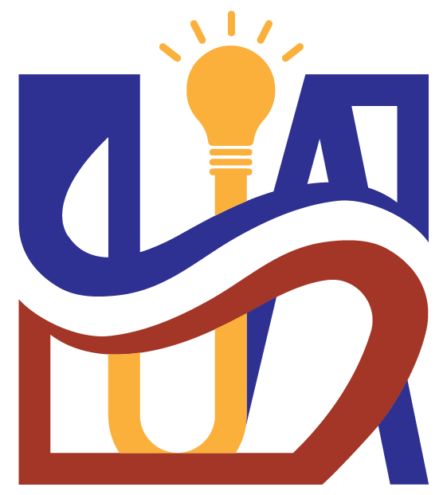

# Welcome to SUA Wiki

This website contains the information and detailed tutorials/solutions of all public contests prepared by the SUA Problem Setter Team. Past contests will be added gradually.

## Contest List

* [The 2025 ICPC Asia East Continent Final (EC-Final)](2025-icpc-ecfinal)
* [The 2025 ICPC Asia Nanjing Regional Contest](2025-icpc-nanjing)
* [The 2025 Shandong Provincial Collegiate Programming Contest](2025-provincial-shandong)
* [The 2025 ICPC Wuhan Invitational Contest](2025-icpc-invitational-wuhan)
* [The 2024 ICPC Asia Hangzhou Regional Contest](2024-icpc-hangzhou)
* [The 2024 ICPC Asia Nanjing Regional Contest](2024-icpc-nanjing)
* [The 2024 ICPC Kunming Invitational Contest](2024-icpc-invitational-kunming)
* [The 2024 CCPC Shandong Invitational Contest and Provincial Collegiate Programming Contest](2024-ccpc-invitational-shandong)
* [The 2023 ICPC Asia Jinan Regional Contest](2023-icpc-jinan)
* [The 2023 ICPC Asia Nanjing Regional Contest](2023-icpc-nanjing)
* [The 2023 Shandong Provincial Collegiate Programming Contest](2023-provincial-shandong)
* [The 2023 Guangdong Provincial Collegiate Programming Contest](2023-provincial-guangdong)
* [The 2022 ICPC Asia Nanjing Regional Contest](2022-icpc-nanjing)
* [The 2021 ICPC Asia Macau Regional Contest](2021-icpc-macau)
* [The 2021 ICPC Asia Nanjing Regional Contest](2021-icpc-nanjing)
* [The 2021 Sichuan Provincial Collegiate Programming Contest](2021-provincial-sichuan)
* [The 2020 ICPC Asia Nanjing Regional Contest](2020-icpc-nanjing)
* [The 2019 Shaanxi Provincial Collegiate Programming Contest](2019-provincial-shaanxi)
* [The 2019 Shandong Provincial Collegiate Programming Contest](2019-provincial-shandong)
* [The 2019 Zhejiang Provincial Collegiate Programming Contest](2019-provincial-zhejiang)
* [The 2019 Zhejiang University Programming Contest](2019-school-zju)
* [The 2018 ICPC Asia Qingdao Regional Contest](2018-icpc-qingdao)
* [The 2018 ICPC Asia Qingdao Regional Contest, Online](2018-icpc-qingdao-online)
* [The 2018 Zhejiang Provincial Collegiate Programming Contest](2018-provincial-zhejiang)
* [The 2018 Zhejiang University Programming Contest](2018-school-zju)
* [The 2017 China Collegiate Programming Contest Qinhuangdao Site](2017-ccpc-qinhuangdao)
* [The 2017 Zhejiang Provincial Collegiate Programming Contest](2017-provincial-zhejiang)
* [The 2017 Zhejiang University Programming Contest](2017-school-zju)
